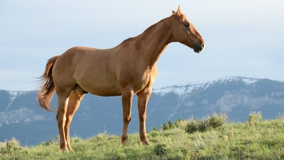
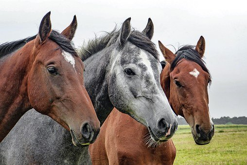
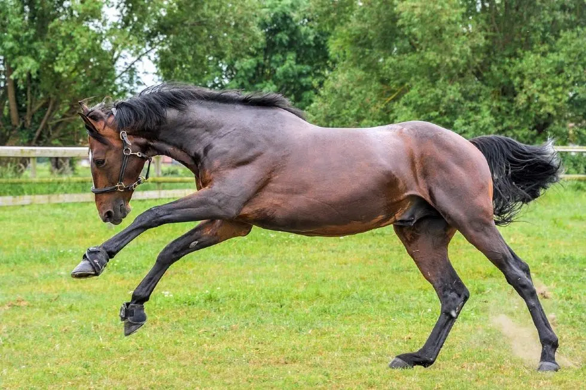

<!doctype html>
<html>
<head>
<meta charset="UTf-8">
</head>
</html>
<body>
 <h1><i>Horses</i></h1>
 

 <h2>Where do horses live?</h2>
 
 <h3 title="<i>With<i> the people">With the people</h3>
 
Almost the <b>entire</b> population of horses have been domesticated

 

 

 <a href="https://www.google.com">Google</a>
 
<a href="photo-1450052590821-8bf91254a353.jpg">horse on a plain</a>
 
 
<table style="width:100%">
  <tr>
    <th>Horse type</th>
    <th>Color</th>
  </tr>
  <tr>
    <td>Clydesdale</td>
    <td>Brown</td>
  </tr>
  <tr>
    <td>Friesian</td>
    <td>White</td>
  </tr>
</table>
 
 <h4>Some breeds of horses</h4>
<ul>
  <li>Clydesdale</li>
  <li>Arabian</li>
  <li>Friesian</li>
</ul>  
